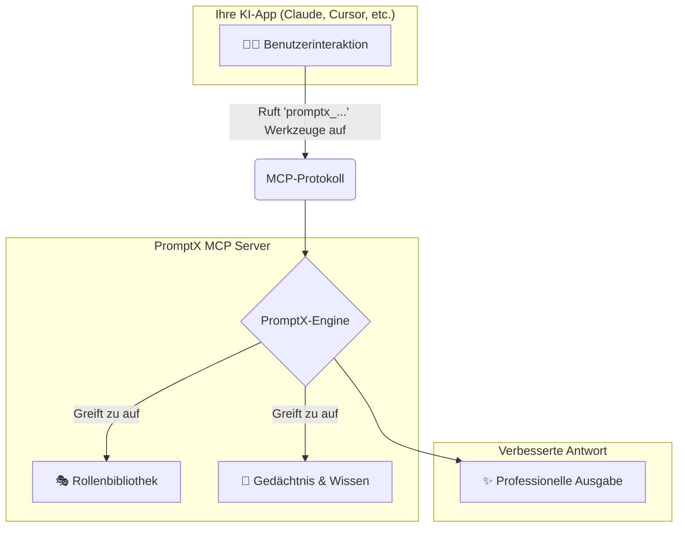

<div align="center">
  
  <h1>PromptX · AI-natives System zur Verbesserung beruflicher Fähigkeiten</h1>
  <p>Bietet spezialisierte Rollen, Speicherverwaltung und Wissenssysteme für KI-Anwendungen über das MCP-Protokoll. Ein Befehl, um jeden KI-Client in ein professionelles Kraftpaket zu verwandeln.</p>

  <!-- Abzeichen -->
  <p>
    <a href=" "></a>
    <a href="https://www.npmjs.com/package/dpml-prompt"></a>
    <a href="LICENSE"></a>
    <a href="https://github.com/Deepractice/PromptX/actions"></a>
  </p>

  <p>
    <a href="README.md">Deutsch</a> |
    <a href="https://github.com/Deepractice/PromptX/issues">Probleme</a>
  </p>
</div>

---

### ✨ **PromptX auf einen Blick verstehen**

Was kann PromptX? Einfach ausgedrückt, es gibt Ihrem KI-Assistenten ein „Gehirn“ und ein „Gedächtnis“ und verwandelt Sie vom Benutzer zum Schöpfer.

- **🎭 Professionelles Rollenspiel**: Bietet Expertenrollen in verschiedenen Bereichen, wodurch KI-Antworten professioneller und tiefgehender werden.
- **🧠 Langzeitgedächtnis & Wissensdatenbank**: Die KI kann sich wichtige Informationen und Ihre Vorlieben merken und bietet so kohärente und personalisierte Unterstützung bei laufenden Gesprächen und Arbeiten.
- **✨ KI-Rollenerstellungsworkshop**: **Erstellen Sie professionelle KI-Assistenten in 2 Minuten** - Verwandeln Sie Ihre Ideen in die Realität und entwickeln Sie sich vom Benutzer zum Schöpfer.
- **🔌 Einfache Integration**: Mit nur einem Befehl können Sie diese leistungsstarken Funktionen für Dutzende von gängigen KI-Anwendungen (wie Claude, Cursor) nahtlos aktivieren.

<br/>

### 📸 **Nutzungseffekte nach der Konfiguration**

#### **1. Entdecken und aktivieren Sie Berufsrollen**
*Verwenden Sie `promptx_welcome`, um verfügbare Rollen zu entdecken, und dann `promptx_action`, um sie zu aktivieren und Ihre KI sofort in einen Fachexperten zu verwandeln.*


#### **2. Intelligenter Speicher**
*Verwenden Sie `promptx_remember`, um wichtige Informationen zu speichern, und die KI wird dieses Wissen bei nachfolgenden Interaktionen proaktiv anwenden.*


---

## ⚠️ **Projekstatus-Hinweis**

PromptX befindet sich derzeit in der **frühen Entwicklungsphase**, und wir verbessern aktiv Funktionen und beheben Fehler. Bevor die offizielle stabile Version erreicht wird, können einige Nutzungsprobleme oder Instabilitäten auftreten.

**Wir bitten aufrichtig um Ihr Verständnis und Ihre Unterstützung!** 🙏

### 📞 **Benötigen Sie Hilfe? Holen Sie sich Unterstützung!**

Wenn Sie während der Nutzung auf Probleme stoßen, kontaktieren Sie uns bitte über:

- 🐛 **Problem einreichen**: [GitHub Issues](https://github.com/Deepractice/PromptX/issues) - Beschreiben Sie das Problem detailliert, wir werden umgehend antworten
- 💬 **Direkter Kontakt**: Fügen Sie den Entwickler WeChat `deepracticex` für sofortige Hilfe hinzu
- 📧 **E-Mail-Kontakt**: Senden Sie eine E-Mail an `sean@deepracticex.com` für technischen Support
- 📱 **Tech-Community**: Scannen Sie den QR-Code unten, um unserer technischen Diskussionsgruppe beizreten

Ihr Feedback ist für uns von unschätzbarem Wert und hilft uns, die Produktqualität schnell zu verbessern! ✨

---

## 🚀 **Schnellstart - 30-Sekunden-Einrichtung**

Öffnen Sie Ihre Konfigurationsdatei und kopieren Sie den folgenden `promptx`-Konfigurationscode. Dies ist der einfachste **Null-Konfigurations-Modus**, bei dem PromptX alles automatisch für Sie erledigt.

```json
{
  "mcpServers": {
    "promptx": {
      "command": "npx",
      "args": [
        "-y",
        "-f",
        "--registry",
        "https://registry.npmjs.org",
        "dpml-prompt@beta",
        "mcp-server"
      ]
    }
  }
}
```

**Konfigurationsparameter:**
- `command`: Gibt an, dass npx zum Ausführen des promptx-Dienstes verwendet wird
- `args`: Liste der Startparameterkonfigurationen
  - `-y`: Automatische Bestätigung
  - `-f`: Cache-Aktualisierung erzwingen
  - `--registry`: Registrierungsquelle angeben
  - `https://registry.npmjs.org`: Offizielle Registrierung verwenden
  - `dpml-prompt@beta`: Stabile Beta-Version verwenden
  - `mcp-server`: Dienst starten

**🎯 So einfach ist das!** Speichern Sie die Datei und starten Sie Ihre KI-Anwendung neu, und PromptX ist erfolgreich aktiviert.

> **💡 Tipp:** Die Konfiguration verwendet speziell die offizielle Registrierung `registry.npmjs.org`, um Installationsprobleme durch inoffizielle Spiegel zu vermeiden. Wenn Sie feststellen, dass die Installation langsam ist, wird empfohlen, ein Proxy-Tool zur Beschleunigung zu verwenden, anstatt zu alternativen Spiegeln zu wechseln.

### 🌐 **Erweiterte Konfiguration: HTTP-Modus-Unterstützung**

Zusätzlich zum oben genannten lokalen Modus unterstützt PromptX auch den **HTTP-Modus**, der für die Remote-Bereitstellung oder spezielle Netzwerkumgebungen geeignet ist:

```bash
# HTTP-Modus-Server starten
npx -f -y dpml-prompt@beta mcp-server --transport http --port 3000
```

Dann in der Client-Konfiguration verwenden:
```json
{
  "mcpServers": {
    "promptx": {
      "url": "http://localhost:3000/mcp"
    }
  }
}
```

📖 **[Vollständige Installations- und Konfigurationsanleitung](https://github.com/Deepractice/PromptX/wiki/PromptX-MCP-Install)** - Detaillierte Konfigurationsmethoden für verschiedene Clients und Fehlerbehebung


### Neu bei MCP? [MCP-Tutorial auf BiliBili ansehen](https://www.bilibili.com/video/BV1HFd6YhErb)

Derzeit können alle KI-Clients, die das MCP-Protokoll unterstützen, PromptX verwenden. Dazu gehören hauptsächlich: **Claude Desktop**, **Cursor**, **Windsurf**, **Cline**, **Zed**, **Continue** und andere gängige KI-Programmierwerkzeuge sowie weitere Anwendungen, die gerade integriert werden.

---

### ⚙️ **Wie es funktioniert**

PromptX fungiert als „professionelle Fähigkeits-Middleware“ zwischen Ihnen und Ihrer KI-Anwendung und kommuniziert über das Standardprotokoll [MCP protocol](https://github.com/metacontroller/mcp).



Wenn Sie die `promptx_...`-Reihe von Werkzeugen aufrufen, sendet Ihre KI-Anwendung die Anfrage über das MCP-Protokoll an PromptX. Die PromptX-Engine lädt die entsprechenden Berufsrollen, ruft relevante Erinnerungen ab und gibt dann ein professionell verbessertes Ergebnis an Ihre KI-Anwendung zurück, das Ihnen letztendlich präsentiert wird.

---

**🎯 Nach der Konfiguration erhält Ihre KI-Anwendung automatisch 6 professionelle Werkzeuge:**
- `promptx_init`: 🏗️ **Systeminitialisierung** - Bereitet die Arbeitsumgebung automatisch vor.
- `promptx_hello`: 👋 **Rollenentdeckung** - Durchsuchen Sie alle verfügbaren Expertenrollen.
- `promptx_action`: ⚡ **Rollenaktivierung** - Verwandeln Sie sich mit einem Klick in einen Experten auf einem bestimmten Gebiet. **(Beinhaltet Nuwa🎨 Rollenerstellungsberater)**
- `promptx_learn`: 📚 **Wissenserwerb** - Lassen Sie die KI spezifisches Wissen oder Fähigkeiten erlernen.
- `promptx_recall`: 🔍 **Gedächtnisabruf** - Suchen Sie nach historischen Informationen aus dem Gedächtnisspeicher.
- `promptx_remember`: 💾 **Erfahrungsspeicherung** - Speichern Sie wichtige Informationen im Langzeitgedächtnis.

📖 **[Vollständige MCP-Integrationsanleitung](docs/mcp-integration-guide.md)**

---

## 🎨 **Nuwa Creation Workshop - Lassen Sie jeden zum KI-Rollendesigner werden**

<div align="center">
  
</div>

#### **💫 Von der Idee zur Realität in nur 2 Minuten**

Haben Sie jemals gedacht: Was wäre, wenn ich einen professionellen KI-Assistenten für ein bestimmtes Arbeitsszenario anpassen könnte? **Nuwa macht diese Idee zur Realität.**

> *"Jede Idee verdient ihren eigenen dedizierten KI-Assistenten. Technische Barrieren sollten den Flug der Kreativität nicht einschränken."*

#### **🎯 Kernwerttransformation**

- **🚀 Barrierefreie Erstellung**: Sie müssen keine komplexen Technologien erlernen, beschreiben Sie einfach Ihre Bedürfnisse in natürlicher Sprache.
- **⚡ Blitzschnelle Lieferung**: Von der Idee bis zur nutzbaren Rolle dauert der gesamte Prozess 2 Minuten.
- **🎭 Professionelle Qualität**: Generiert automatisch professionelle KI-Rollen, die den DPML-Standards entsprechen.
- **🔄 Plug-and-Play**: Kann sofort nach der Erstellung aktiviert und verwendet werden.
- **💝 Gefühl der Kontrolle**: Eine großartige Wendung vom Benutzer zum Schöpfer.

#### **✨ Anwendungsbeispiele**

<div align="center">

| 🎯 **Benutzerbedarf** | ⚡ **Nuwa generiert** | 🚀 **Einsatzbereit** |
|---|---|---|
| 👩‍💼 „Ich brauche einen KI-Assistenten, der Xiaohongshu-Marketing versteht“ | Xiaohongshu-Marketing-Expertenrolle | `Aktiviere Xiaohongshu-Marketing-Experte` |
| 👨‍💻 „Ich möchte einen Experten für asynchrone Python-Programmierung“ | Python Asynchronous Programming Tutor Role | `Aktiviere Python Asynchronous Programming Tutor` |
| 🎨 „Gib mir einen UI/UX-Designberater“ | UI/UX-Design-Expertenrolle | `Aktiviere UI/UX-Design-Experte` |
| 📊 „Ich brauche einen Datenanalysten-Assistenten“ | Datenanalyse-Expertenrolle | `Aktiviere Datenanalyse-Experte` |

</div>

#### **🎪 Erleben Sie Nuwas Kreativität - 4 Schritte zur Erstellung eines benutzerdefinierten KI-Assistenten**

<div align="center">
  <div align="center">
  
  
  
  
</div>
</div>

```bash
# 1️⃣ Aktivieren Sie den Nuwa-Rollenerstellungsberater
"Ich möchte, dass Nuwa mir hilft, eine Rolle zu erstellen"

# 2️⃣ Beschreiben Sie Ihre Bedürfnisse (natürliche Sprache ist in Ordnung)
"Ich brauche einen professionellen Assistenten im [Bereich], hauptsächlich für [spezifisches Szenario]"

# 3️⃣ Warten Sie 2 Minuten, bis Nuwa eine professionelle Rolle für Sie generiert hat
# Nuwa erstellt die Rollendatei, registriert sie im System und führt Qualitätsprüfungen durch

# 4️⃣ Aktivieren und verwenden Sie sofort Ihren benutzerdefinierten KI-Assistenten
"Aktiviere die gerade erstellte Rolle"
```

#### **🌟 Nuwas Designphilosophie**

- **🎯 Grenzenlose Schöpfung**: Ermöglicht jedem mit einer Idee, einen KI-Assistenten zu erstellen und technische Barrieren abzubauen.
- **⚡ Sofortige Befriedigung**: Erfüllt die Nachfrage nach Unmittelbarkeit im digitalen Zeitalter.
- **🧠 Geführtes Wachstum**: Es geht nicht nur darum, ein Werkzeug zu benutzen, sondern auch darum, die Benutzer anzuleiten, die Grenzen der KI-Fähigkeiten zu verstehen.
- **🌱 Ökosystem-Mitgestaltung**: Die von jedem Benutzer erstellten Rollen können für andere eine Inspirationsquelle werden.

---

## 📋 **Praxisfälle: Legacy Lands Library**

<div align="center">
  
</div>

#### 📖 Projektübersicht

**Projektname:** Legacy Lands Library
**Projekt-URL:** https://github.com/LegacyLands/legacy-lands-library
**Projektbeschreibung:** legacy-lands-library ist eine Entwicklungstoolkit-Bibliothek für die moderne Minecraft-Server-Plugin-Entwicklung. Ziel ist es, Entwicklern eine plattformübergreifende, produktionsreife Infrastruktur zur Verfügung zu stellen.

#### 🏢 Organisationsinformationen

**Organisationsname:** Legacy Lands
**Offizielle Website:** https://www.legacylands.cn/
**Organisationsbeschreibung:** Legacy Lands ist ein innovatives Team, das sich auf die Entwicklung von groß angelegten Minecraft-Zivilisationssimulationserlebnissen konzentriert. Sie beteiligen sich an der Open-Source-Community und bieten elegante, effiziente und zuverlässige Lösungen für Bereiche wie Minecraft-Server-Plugins.

> #### **💡 Erfahrungen von Kernentwicklern**
> „Die Entwicklungserfahrung mit PromptX ist wirklich anders. Unser Team, das Claude Code in Kombination mit PromptX verwendet, hatte **einen Entwickler, der in nur drei Tagen über 11.000 Zeilen hochwertigen Java-Code fertigstellte.**
>
> Der Wert dieses Workflows wird in der tatsächlichen Entwicklung voll demonstriert. PromptX löst viele Probleme bei der Verwendung von KI und gewährleistet jederzeit einen einheitlichen Codestil und Qualitätsstandards, was die Lernkurve für neue Mitglieder erheblich reduziert. Best Practices, die früher wiederholte Kommunikation und die Abhängigkeit von der Dokumentation erforderten, sind jetzt bei jeder Codegenerierung selbstverständlich integriert."
>
> ---
>
> „‚Nuwa‘ macht es für mich bequemer und schneller, KI-Rollen zu verwenden. Ich habe festgestellt, dass ich weder programmieren noch komplexe KI-Prinzipien verstehen muss. Ich muss ‚Nuwa‘ nur in einfachen Worten sagen, was ich will, und es kann die komplexe Designarbeit hinter den Kulissen erledigen und mich durch den Rest führen. ‚Nuwa‘ selbst schreibt keine Little Red Book-Notizen, aber es kann einen Experten erstellen, der ‚im Little Red Book-Marketing versiert‘ ist. Sobald dieser Experte erstellt ist, kann ich alle meine zukünftigen Little Red Book-bezogenen Arbeiten an diese neue Rolle übergeben, was die Effizienz und Professionalität erheblich verbessert."

#### **📚 Zugehörige Ressourcen**

- **KI-Integrationsstandards & Praxishandbuch:** https://github.com/LegacyLands/legacy-lands-library/blob/main/AI_CODE_STANDARDS_ZHCN.md

---

## 📚 **Community-Tutorials & -Fälle**

Community-Mitglied **coso** hat ein MCP-Tool basierend auf der PromptX-Architektur entwickelt und die vollständige Entwicklungserfahrung geteilt:

#### 🔧 **Entwicklung des crawl-mcp-Tools mit der PromptX-Architektur**
- **Artikel**: [Von der Idee zum Produkt: Wie ich ein intelligentes Inhaltsverarbeitungs-MCP-Tool mit dem Cursor Agent entwickelt habe](https://mp.weixin.qq.com/s/x23Ap3t9LBDVNcr_7dcMHQ)
- **Ergebnis**: [crawl-mcp-server](https://www.npmjs.com/package/crawl-mcp-server) - NPM-Paket | [GitHub](https://github.com/wutongci/crawl-mcp)
- **Highlight**: Verwendung von PromptX als Architekturreferenz, Erzielung einer Null-Code-Entwicklung, von der Idee bis zur Veröffentlichung in nur wenigen Stunden.

#### 🛠️ **Vorlagenbasierte Praxis für die MCP-Entwicklung**
- **Artikel**: [Vom Null-Code zum Open Source: Wie ich die MCP-Entwicklung mit einer Vorlage revolutioniert habe](https://mp.weixin.qq.com/s/aQ9Io2KFoQt8k779L5kuuA)
- **Ergebnis**: [mcp-template](https://github.com/wutongci/mcp-template) - Eine universelle MCP-Entwicklungsvorlage
- **Wert**: Reduzierte MCP-Entwicklungszeit von 40 Stunden auf 30 Minuten.

#### 🧠 **feishu-mcp** - Barrierefreie Lösung für den Gedächtnisverlust von Cross-AI-Tools
- **Autor**: Community-Mitglied
- **Links**: [Anwendungsfreigabe](https://mp.weixin.qq.com/s/TTl3joJYR2iZU9_NSI2Hbg) | [NPM](https://www.npmjs.com/package/@larksuiteoapi/lark-mcp)
- **Highlight**: Nahtlose Speicherkontinuität über verschiedene KI-Tools und -Plattformen hinweg.

#### 🎓 **KI-Bildungsexpertenteam** - Zusammenarbeit mit mehreren Rollen zur Erstellung hochwertiger systematischer Bildungsinhalte
- **Autor**: Community-Bildungsfachmann
- **Links**: [Innovationsfreigabe](https://mp.weixin.qq.com/s/8mAq1r5kqAOJM1bmIWlYbQ)
- **Highlight**: Nutzung mehrerer Expertenrollen zur Erstellung umfassender, strukturierter Lehrmaterialien.

#### ⚖️ **KI-Scheinprozess** - Immersives Gerichtssaalerlebnis mit 57.000 Wörtern professioneller Transkripte und Urteilsvorlagen
- **Autor**: Community Legal Professional
- **Links**: [Fallstudie](https://mp.weixin.qq.com/s/gscpUqiApktaSO3Uio5Iiw) | [GitHub](https://github.com/jiangxia/ai-trial)
- **Highlight**: Zusammenarbeit mit mehreren Rollen zur Erstellung immersiver Prozesssimulationen mit produktionsreifer juristischer Dokumentation.

> 💡 Wir laden Community-Mitglieder ein, ihre praktischen Erfahrungen mit PromptX zu teilen. Senden Sie einen PR, um ihn hier hinzuzufügen.

---

## ⭐ **Star-Wachstumstrend**

[](https://star-history.com/#Deepractice/PromptX&Date)

---

### **🤝 Beitrag & Kommunikation**

Wir freuen uns über jede Form von Beitrag und Feedback!

- 🌿 **[Verzweigungsstrategie](docs/BRANCHING.md)** - Verzweigungs- und Freigabeprozess
- 🚀 **[Freigabeprozess](docs/RELEASE.md)** - Versionsverwaltung und Freigabedokumentation

Scannen Sie den QR-Code, um unserer Tech-Community-Gruppe beizutreten:


---

## 📄 **Lizenz**

[MIT-Lizenz](LICENSE) - Professionelle KI-Fähigkeiten zugänglich machen.

---

**🚀 Jetzt loslegen: Starten Sie den PromptX MCP Server und erweitern Sie Ihre KI-Anwendung um professionelle Funktionen!**
